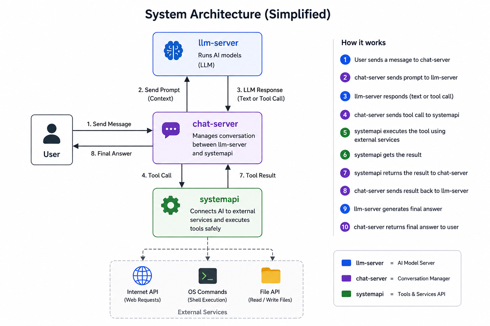

<p align="center">
  
</p>

# FRTGG — Your PC's Native AI

> An AI assistant that doesn't just chat. It lives inside your PC, understands it, and controls it.

---

## What is it?

FRTGG is a **local AI assistant** that runs entirely on your computer. Unlike cloud-based AI , it can actually **see and control your PC** — open apps, run commands, manage files, search the web, and speak back to you.

**No internet required. No data leaves your machine. 100% private.**

---

## What can it do?

| Feature | What it means for you |
|---------|----------------------|
|  **System Control** | Runs PowerShell, opens programs, manages processes — all by voice or text |
|  **File Manager** | Reads, writes, edits, and organizes your files automatically |
| **Web Search** | Searches the internet and summarizes results instantly |
|  **Text-to-Speech** | Speaks responses out loud  |
|  **Local LLM** | Runs AI models (Llama, Mistral, Qwen, DeepSeek...) entirely offline |
|  **Smart Sessions** | Saves conversations, remembers context across restarts |
|  **Multi-Model** | Load multiple AI models and switch between them instantly |

---

## Quick Start

### Requirements
- Windows 10/11
- Python 3.10
- A GGUF model file (download from [HuggingFace](https://huggingface.co/models?library=gguf))

## Supported Platforms

| Component | Windows | macOS | Linux |
| :--- | :---: | :---: | :---: |
| **llm-server** | ✅ | ✅ | ✅ |
| **systemapi** | ✅ | ❌ | ❌ |
| **chat-server** | ✅ | ✅ | ✅ |
| **internetapi** | ✅ | ✅ | ✅ |
| **reconweb#farm_harvest** | ✅ | ✅ | ✅ |
| **tts** | ✅ | ❌ | ✅ |
| **fileapi** | ✅ | ✅ | ✅ |

### Install
```bash
git clone https://github.com/jawadfarm/frtgg_local_ai-Assistant.git
```

### Run
```bash
# 1. start the installer
python installer.py

#2. install runner requirements

pip install -r runner-requirements.txt

# 3. install llama.cpp
cd core
python llama-installer.py

# 3. Start the runner
python runner.py

http://localhost:8721
(RUN FUll system)

# Open your browser
http://localhost:8900
```


---

## How it works (simple)

```

```

1. **You** → Web interface (Send a request)

2. **AI thinks** → Local LLM decides what to do

3. **Chat Server** → Detects and parses the commands

4. **System API** → Receives and processes the commands (executes them)

5. **AI responds** → Speaks and shows the results

---

## Example Interactions

> **You:** "Find all PDF files in Downloads and list them"
>
> **FRTGG:** *runs command* "Found 12 PDFs. Largest is 'report_2024.pdf' at 4.2MB. Want me to open it?"

> **You:** "Search for latest React documentation"
>
> **FRTGG:** *searches web* "Here are the top 3 results... [summaries]. Want me to fetch the full page?"

> **You:** "Open Notepad and write a todo list"
>
> **FRTGG:** *opens Notepad* "Done. What should I add to the list?"

---

## Architecture

| Component | Port | Purpose |
|-----------|------|---------|
| Chat UI | 8900 | Web interface you interact with |
| AI Backend (HTTP) | 8112 | LLM API, model loading, settings |
| AI Backend (TCP) | 8111 | Real-time streaming responses |
| System Controller | 8300 | Executes PC commands safely |
| Prompt Manager | 8203 | Manage AI personality/prompts |

The system runs entirely over the network. You have the flexibility to change where the servers are located:

- You can run the **LLM server** on a second machine, or move it to external servers.
- The **LLM server** also supports **OpenAI**.

> **Note:** When using OpenAI, you must provide your API key (this acts as the authentication password you set).

---

## Tech Stack

- **AI Engine**: llama.cpp (any GGUF model)
- **Backend**: Python (threaded HTTP + TCP servers)
- **Frontend**:  HTML/JS

---

## Roadmap

###  Current (MVP)
- Local LLM with any GGUF model
- Voice and text control
- System commands, file operations, web search
- Multi-model loading
- Session management

###  Coming Soon
-  **Screen Vision**
- **stt-speak to text** 
-  **MCP protocol support** 
- **Enhanced support and bug fixes** 
-  **memory** 
-  **skills**

---

## License

MIT — Free to use, modify, and distribute.

---

